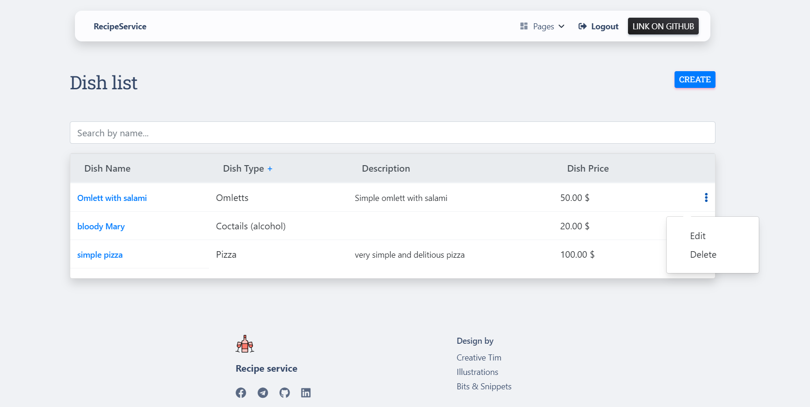

# Recipe-Service

Django project for people to share recipes

## Check it out:

[Recipe Service deployed to Render]()

## Installation

Python3 must be already installed

````shell
git clone https://github.com/Nap14/Recipe-Service.git
cd Recipe-Service
python -m venv env
env\Scripts\activate
pip install -r requirements.txt
python manage.py runserver #  Starts Django server
````


## Features

* Authentication functionality for Chef/User
* Managing dish, dish type, products directly from website
* Powerful admin panel for advanced managing


## Demo


